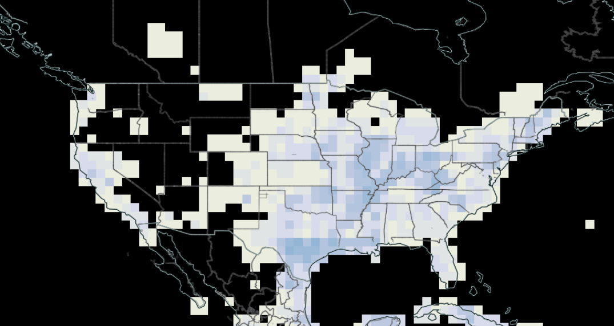

# Discussion 

## What can we extrapolate from this? 
Extreme weather predictions should be aware of the blind spots in its predictions. 

Flood warnings for extreme events should place extra focus on how vulnerable communities will be affected by an event
 - Are our warning systems reaching everyone equally? 
 - Are evacuation routes up to date? 
 - How can hydrologists and meteorologists better inform local governments on disproportionate community impact?  

## What's missing here in the models? 🤔

## The state of Earth data? 🌍
It's uneven! 

### Use of CMIP5 
- Climate models do well on average, and do not give a complete picture of the possibility of anomalous events.
- Predicting anomalous events is _hard_
- Data biases
    - Arctic climate performance
    - Tropical climate performance

## How do we measure disadvantage and vulnerability ? 📈

"Vulnerability" is not something that we can easily validate or measure. 

Where are we getting our social demographic data?
- Is it coming from government census? 
- If so, who isn't answering it, and can we trust the answers inherently?

### SVI Issues
- Variable choice in how this index is calculated is essential, and can greatly influence the result.
- SVI can lead to results that counter the literature: 
 "variable-wise contributions ran counter to expectations based on the social scientific literature (e.g., higher poverty levels counterintuitively led to lower SoVI scores)" ([Speilman et al, 2020](https://link.springer.com/article/10.1007/s11069-019-03820-z#Sec11))
  - Article posted in Natural Hazards Journal 

### Other indices are available!  
- Area Deprivation Index (ADI)
- Child Opportunity Index (COI)

 [Lau et al (2023)](https://www.sciencedirect.com/science/article/abs/pii/S1353829223000345) find that ADI and Child Opportunity Index (COI) are strong indices for community outcomes. 
    - Future work should investigate the inclusion of these additional indexes. 
- There is also the Area Deprivation Index (ADI)
Figure shows higher SVI in Southwest coastal Texas: 

[Previous page: Visualizations](visualizations.md)

[Next page: Conclusion](conclusion.md)