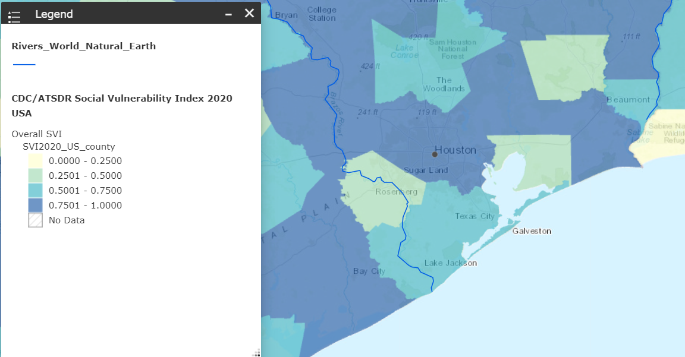

# Methods
Compare and combine digital elevation model (DEM), FEMA flood risk, land use, social vulnerability index (SVI), and CMIP5 precipitation projections to evaluate disproportionate risk to precipitation anomalies.

## Region: Houston area

## DEM

We combined digital elevation model (DEM) data to get a roughness and relief map to inform the topographic characteristics of the watershed. 

_Digital Elevation Model (USGS 30m)_

## Land Use

Land use and land cover map [City of Houston GIS Hub](https://gishub-h-gac.hub.arcgis.com/pages/b0970d93444742268790ec9d4161e742)

## FEMA 

Hydrometric data (FEMA Flood Map over 50 or 100 years later)

## CMIP 

The Climate Model Intercomparison versions 5 and 6 contain maximum precipitation estimates over extended periods (25, 50, 100 years). 

These models are the best we have to give us a good picture of climatology for temperature, precipitation, etc.

## Example data from 100-year CMIP6 projections
From:  [Global exposure to flooding from the new CMIP6 climate model projections](https://www.nature.com/articles/s41598-021-83279-w) (Hirabayashi et al 2021)
CMIP6 has n-year flood discharge predictions that we can factor into our spatial data. 

## Social vulnerability index (SVI) 
SVI is a metric created by the CDC using US Census data to help local officials "identify communities that may need support before, during, or after disasters" ([CDC](https://www.atsdr.cdc.gov/placeandhealth/svi/index.html) )

**Social Vulnerability:** The degree to which communities are susceptible to external factors such as epidemics and natural disasters. 

Variables included:

Figure shows higher SVI in Southwest coastal Texas: 

[Previous page: Overview](README.md) 

[Next page: Visualizations](visualizations.md)
